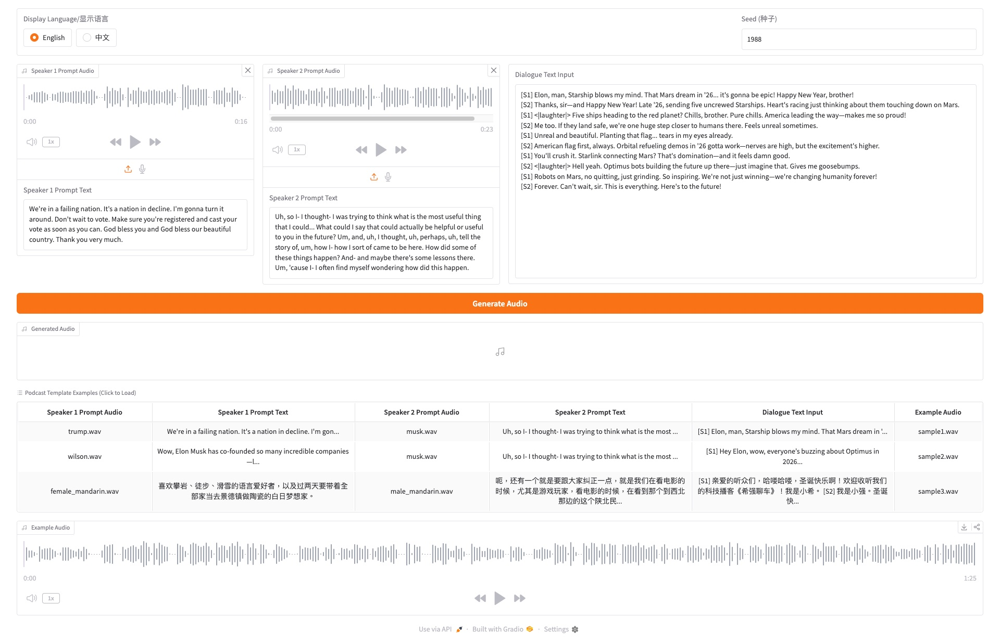
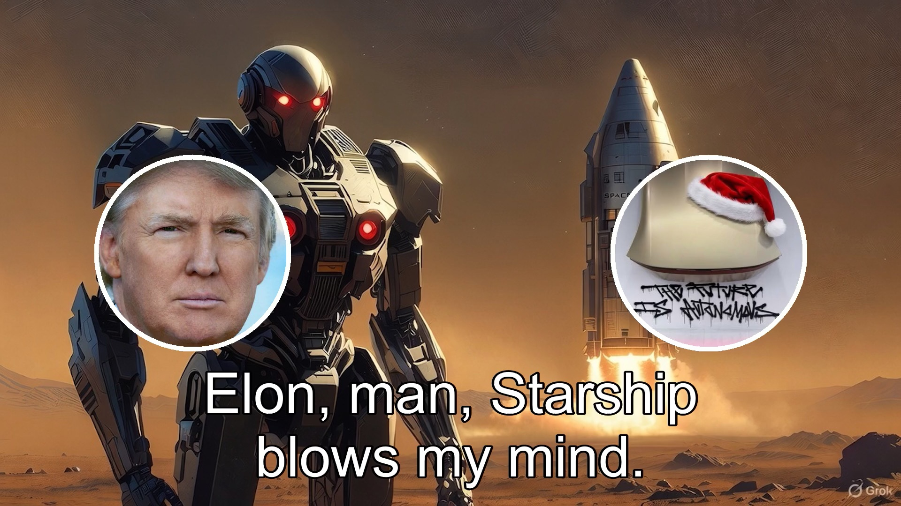

## 🔗 Original Project
This project is forked from: https://github.com/Soul-AILab/SoulX-Podcast

All original credit goes to the original authors.

## ✨ What's New in This Fork

- Added **podcast conversation samples featuring Trump and Musk**
- A **temporarily hosted server** is provided for enthusiasts to explore and learn  
  > The service is running on a **single V100 GPU**, so computing resources are limited. Please be patient during usage.

- Users can:
  - Record their own voice and have conversations with **Trump or Musk**
  - Download the generated dialogue audio
  - Use **Whisper** to generate conversation scripts (SRT)
  - Use **FFmpeg** to compose audio, subtitles, avatars, and backgrounds into videos

- All sample videos include:
  - Dialogue scripts
  - Background images  
  generated by **Grok**


<div align="center">
    <h1>
    SoulX-Podcast
    </h1>
    <p>
    Official inference code for <br>
    <b><em>SoulX-Podcast: Towards Realistic Long-form Podcasts with Dialectal and Paralinguistic Diversity</em></b>
    </p>
    <p>
    <!--  -->
    
    </p>
    <p>
    </p>
    <a href="https://soul-ailab.github.io/soulx-podcast/"></a>
    <a href="https://huggingface.co/collections/Soul-AILab/soulx-podcast"></a>
    <a href="https://arxiv.org/pdf/2510.23541"></a>
    <a href="https://huggingface.co/Soul-AILab/spaces"></a>
    <a href="https://github.com/Soul-AILab/SoulX-Podcast"></a>
</div>


<p align="center">
   <h1>SoulX-Podcast: Towards Realistic Long-form Podcasts with Dialectal and Paralinguistic Diversity</h1>
<p>

##  Overview
SoulX-Podcast: Towards Realistic Long-form Podcasts with Dialectal and Paralinguistic Diversity

SoulX-Podcast is designed for podcast-style multi-turn, multi-speaker dialogic speech generation, while also achieving superior performance in the conventional monologue TTS task.

To meet the higher naturalness demands of multi-turn spoken dialogue, SoulX-Podcast integrates a range of paralinguistic controls and supports both Mandarin and English, as well as several Chinese dialects, including Sichuanese, Henanese, and Cantonese, enabling more personalized podcast-style speech generation.


## Key Features 🔥

- **Long-form, multi-turn, multi-speaker dialogic speech generation**: SoulX-Podcast excels in generating high-quality, natural-sounding dialogic speech for multi-turn, multi-speaker scenarios.

- **Cross-dialectal, zero-shot voice cloning**: SoulX-Podcast supports zero-shot voice cloning across different Chinese dialects, enabling the generation of high-quality, personalized speech in any of the supported dialects.

- **Paralinguistic controls**: SoulX-Podcast supports a variety of paralinguistic events, as as ***laugher*** and ***sighs*** to enhance the realism of synthesized results.
- **Paralinguistic tags**: <|laughter|>, <|sigh|>, <|breathing|>, <|coughing|>, <|throat_clearing|> .

<table align="center">
  <tr>
    <td align="center"><br></td>
  </tr>
</table>

## Demo

Try our online demo: [🌐 http://173.208.210.27:7860/](http://173.208.210.27:7860/)

or

Record your voice and have a conversation with Trump and Musk: [🌐 https://cir-and-layout-ceo.trycloudflare.com/](https://cir-and-layout-ceo.trycloudflare.com/)


<p align="center">
  
</p>

## Demo Examples
example1.mp4
<div align="center">

[](https://wangxing-ye.github.io/SoulX-Podcast/sample1.mp4)

</div>

example2.mp4
<div align="center">

[](https://wangxing-ye.github.io/SoulX-Podcast/sample2.mp4)

</div>

example3.mp4
<div align="center">

[](https://wangxing-ye.github.io/SoulX-Podcast/sample3.mp4)

</div>

For more examples, see [demo page](https://soul-ailab.github.io/soulx-podcast/).


## 🚀 News
- **[2025-11-03]** Support vllm with docker.
- **[2025-10-31]** Deploy an online demo on [Hugging Face Spaces](https://huggingface.co/Soul-AILab/spaces).

- **[2025-10-30]** Add example scripts for monologue TTS and support a WebUI for easy inference.

- **[2025-10-29]** We are excited to announce that the latest SoulX-Podcast checkpoint is now available on Hugging Face! You can access it directly from [SoulX-Podcast-hugging-face](https://huggingface.co/collections/Soul-AILab/soulx-podcast).

- **[2025-10-28]** Our paper on this project has been published! You can read it here: [SoulX-Podcast](https://arxiv.org/pdf/2510.23541).

## Install

### Clone and Install
Here are instructions for installing on Linux.
- Clone the repo
```
git clone git@github.com:Soul-AILab/SoulX-Podcast.git
cd SoulX-Podcast
```
- Install Conda: please see https://docs.conda.io/en/latest/miniconda.html
- Create Conda env:
```
conda create -n soulxpodcast -y python=3.11
conda activate soulxpodcast
pip install -r requirements.txt
# If you are in mainland China, you can set the mirror as follows:
pip install -r requirements.txt -i https://mirrors.aliyun.com/pypi/simple/ --trusted-host=mirrors.aliyun.com
```
- [Optional] VLLM accleration(Modified version from vllm 0.10.1)
```
cd runtime/vllm
docker build -t soulxpodcast:v1.0 .
# Mounts the host directory at LOCAL_RESOURCE_PATH to CONTAINER_RESOURCE_PATH in the container, enabling file sharing between the host system and container. To access the web application, add -p LOCAL_PORT:CONTAINER_PORT
# example: docker run -it --runtime=nvidia  --name soulxpodcast  -v /mnt/data:/mnt/data -p 7860:7860 soulxpodcast:v1.0
docker run -it --runtime=nvidia  --name soulxpodcast  -v LOCAL_RESOURCE_PATH:CONTAINER_RESOURCE_PATH soulxpodcast:v1.0
```

### Model Download

```sh
pip install -U huggingface_hub

# base model
huggingface-cli download --resume-download Soul-AILab/SoulX-Podcast-1.7B --local-dir pretrained_models/SoulX-Podcast-1.7B

# dialectal model
huggingface-cli download --resume-download Soul-AILab/SoulX-Podcast-1.7B-dialect --local-dir pretrained_models/SoulX-Podcast-1.7B-dialect
```


Download via python:
```python
from huggingface_hub import snapshot_download

# base model
snapshot_download("Soul-AILab/SoulX-Podcast-1.7B", local_dir="pretrained_models/SoulX-Podcast-1.7B") 

# dialectal model
snapshot_download("Soul-AILab/SoulX-Podcast-1.7B-dialect", local_dir="pretrained_models/SoulX-Podcast-1.7B-dialect") 

```

Download via git clone:
```sh
mkdir -p pretrained_models

# Make sure you have git-lfs installed (https://git-lfs.com)
git lfs install

# base model
git clone https://huggingface.co/Soul-AILab/SoulX-Podcast-1.7B pretrained_models/SoulX-Podcast-1.7B

# dialectal model
git clone https://huggingface.co/Soul-AILab/SoulX-Podcast-1.7B-dialect pretrained_models/SoulX-Podcast-1.7B-dialect
```


### Basic Usage

You can simply run the demo with the following commands:
``` sh
# dialectal inference
bash example/infer_dialogue.sh
```

### WebUI

You can simply run the webui with the following commands:
``` sh
# Base Model:
python3 webui.py --model_path pretrained_models/SoulX-Podcast-1.7B

# If you want to experience dialect podcast generation, use the dialectal model:
python3 webui.py --model_path pretrained_models/SoulX-Podcast-1.7B-dialect


```

### MP4 Video

You can simply build a video with ffmpeg and whisper.
``` sh
# Install whisper:
brew install openai-whisper

# Install ffmpeg:
brew install ffmpeg

# Generate subtitle:
whisper sample.wav --model medium --output_format srt

#Build video (bg.jpg 1920x1080, s1.jpg 400x400, s2.jpg 400x400):
ffmpeg \
-loop 1 -i bg.jpg \
-loop 1 -i s1.jpg \
-loop 1 -i s2.jpg \
-i sample.wav \
-filter_complex "
[0:v]format=yuv420p[bg];

[1:v]format=rgba,
geq=lum='p(X,Y)':a='if(lte((X-200)^2+(Y-200)^2,200^2),255,0)'[a1];

[2:v]format=rgba,
geq=lum='p(X,Y)':a='if(lte((X-200)^2+(Y-200)^2,200^2),255,0)'[a2];

[bg][a1]overlay=200:(H-h)/2[tmp1];
[tmp1][a2]overlay=W-w-200:(H-h)/2,
subtitles=sample.srt:force_style='Fontsize=48,Alignment=2'
" \
-c:v libx264 \
-pix_fmt yuv420p \
-c:a aac \
-shortest \
sample.mp4
```


## TODOs
- [x] Add example scripts for monologue TTS.
- [x] Publish the [technical report](https://arxiv.org/pdf/2510.23541).
- [x] Develop a WebUI for easy inference.
- [x] Deploy an online demo on [Hugging Face Spaces](https://huggingface.co/Soul-AILab/spaces).
- [x] Dockerize the project with vLLM support.
- [ ] Add support for streaming inference.

## Citation

```bibtex
@misc{SoulXPodcast,
  title        = {SoulX-Podcast: Towards Realistic Long-form Podcasts with Dialectal and Paralinguistic Diversity},
  author       = {Hanke Xie and Haopeng Lin and Wenxiao Cao and Dake Guo and Wenjie Tian and Jun Wu and Hanlin Wen and Ruixuan Shang and Hongmei Liu and Zhiqi Jiang and Yuepeng Jiang and Wenxi Chen and Ruiqi Yan and Jiale Qian and Yichao Yan and Shunshun Yin and Ming Tao and Xie Chen and Lei Xie and Xinsheng Wang},
  year         = {2025},
  archivePrefix={arXiv},
  url          = {https://arxiv.org/abs/2510.23541}
}

```

## License

We use the Apache 2.0 license. Researchers and developers are free to use the codes and model weights of our SoulX-Podcast. Check the license at [LICENSE](LICENSE) for more details.


## Acknowledge
- This repo benefits from [FlashCosyVoice](https://github.com/xingchensong/FlashCosyVoice/tree/main)


##  Usage Disclaimer
This project provides a speech synthesis model for podcast generation capable of zero-shot voice cloning, intended for academic research, educational purposes, and legitimate applications, such as personalized speech synthesis, assistive technologies, and linguistic research.

Please note:

Do not use this model for unauthorized voice cloning, impersonation, fraud, scams, deepfakes, or any illegal activities.

Ensure compliance with local laws and regulations when using this model and uphold ethical standards.

The developers assume no liability for any misuse of this model.

We advocate for the responsible development and use of AI and encourage the community to uphold safety and ethical principles in AI research and applications. If you have any concerns regarding ethics or misuse, please contact us.

## Contact Us
If you are interested in leaving a message to our work, feel free to email hkxie@mail.nwpu.edu.cn or linhaopeng@soulapp.cn or lxie@nwpu.edu.cn or wangxinsheng@soulapp.cn

You’re welcome to join our WeChat group for technical discussions, updates.
<p align="center">
  <!-- <em>Due to group limits, if you can't scan the QR code, please add my WeChat for group access  -->
      <!-- : <strong>Tiamo James</strong></em> -->
  <br>
  <span style="display: inline-block; margin-right: 10px;">
    
  </span>
  <!-- <span style="display: inline-block;">
    
  </span> -->
</p>

## Star History

[](https://www.star-history.com/#Soul-AILab/SoulX-Podcast&type=date&legend=top-left)
